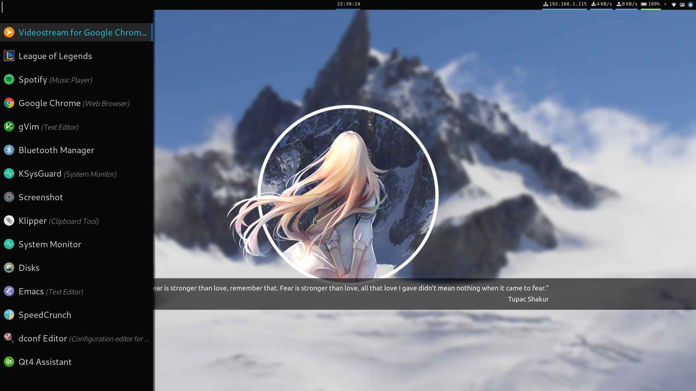
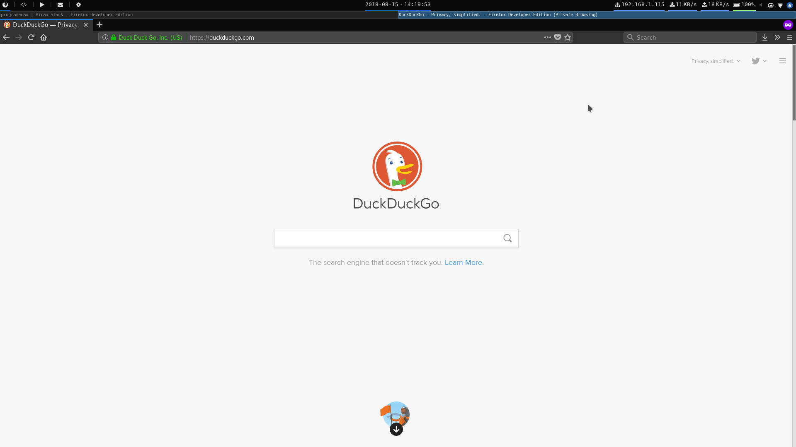
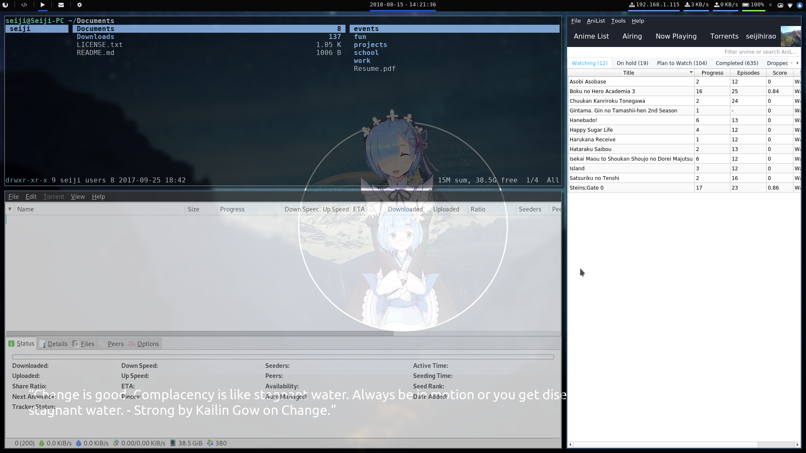
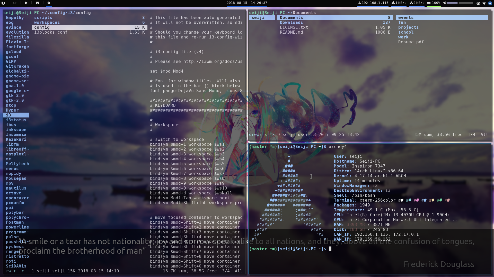
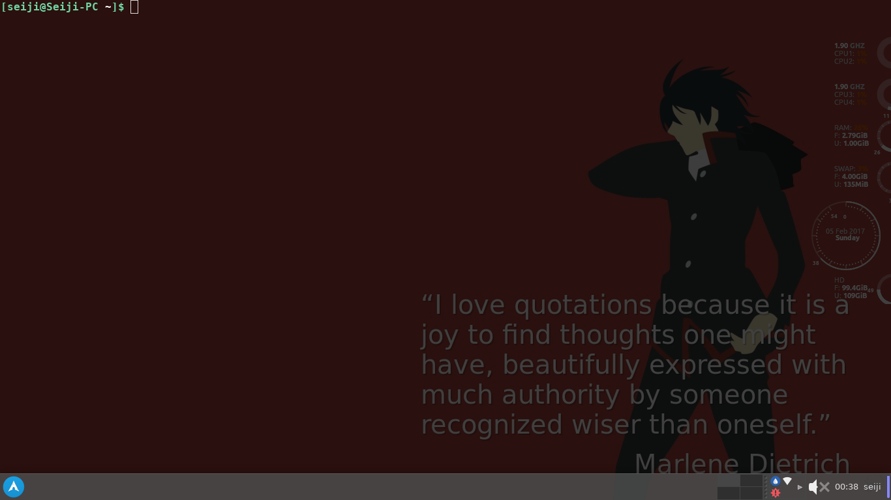
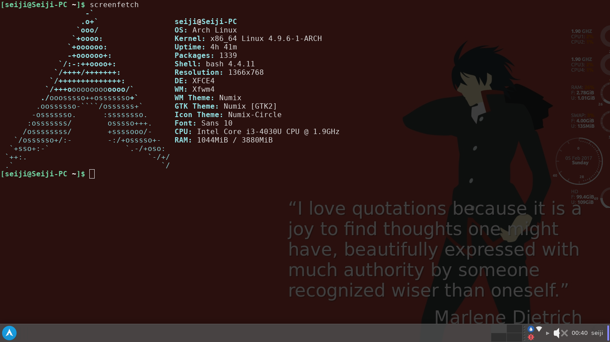
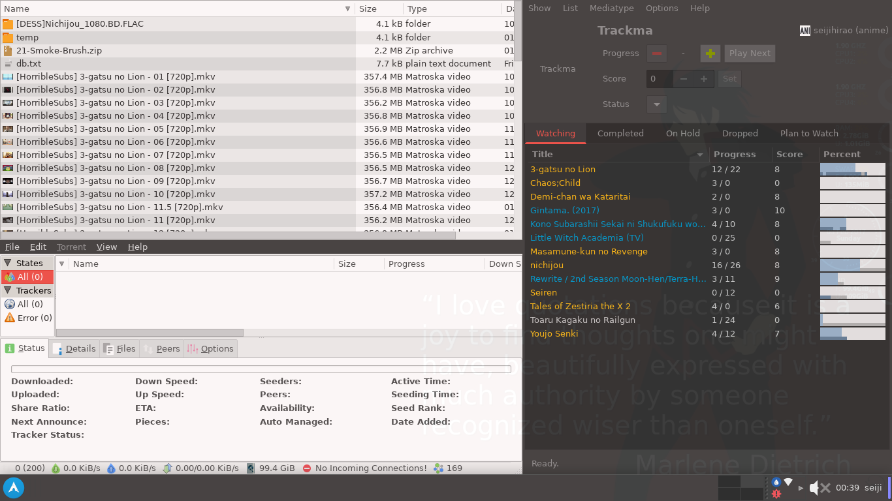
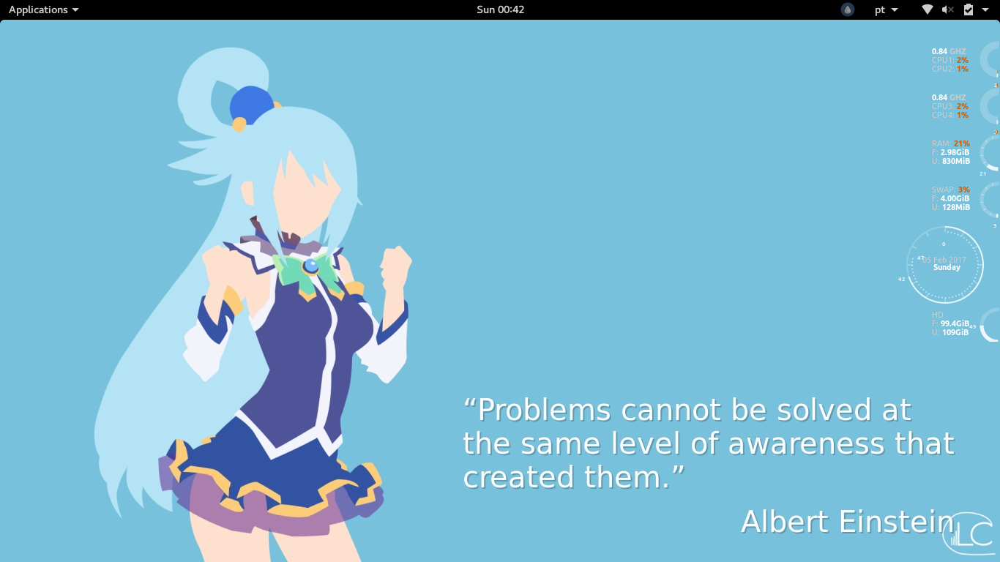
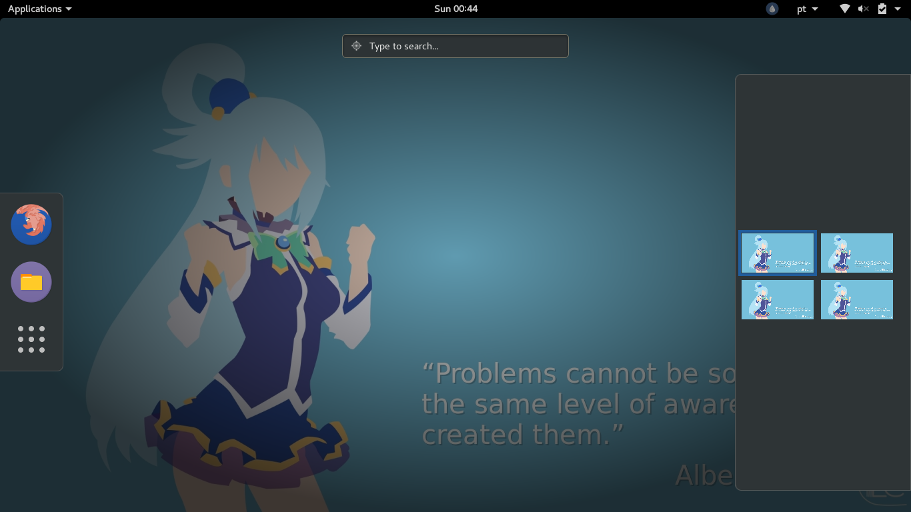

# SEIJI DOTFILES

Hello!!! And wellcome to my dotfiles!

Here are listed my shared configuration files :)! Feel free to use something or send me pull requests/feedbacks.

## Setup/Config files

### i3

To select startup apps and workspace capturing go to file

`.config/i3/scripts/startup`

### Polybar

Setup the environment variables located at

`.config/bash/devices.sh`

## Preview

### i3

### XFCE4

### GNOME 3

## My Apps

My apps are located at `.config/.apps` but they might be too many,
I need to do a cleanup

Just run `$ sudo xargs pacman -S --needed --noconfirm < .config/.apps`

