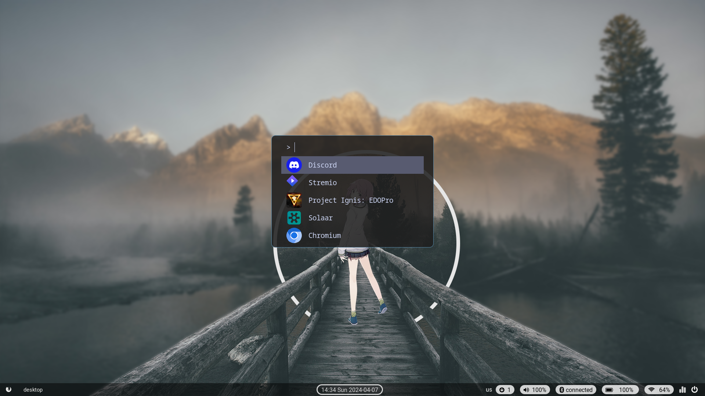
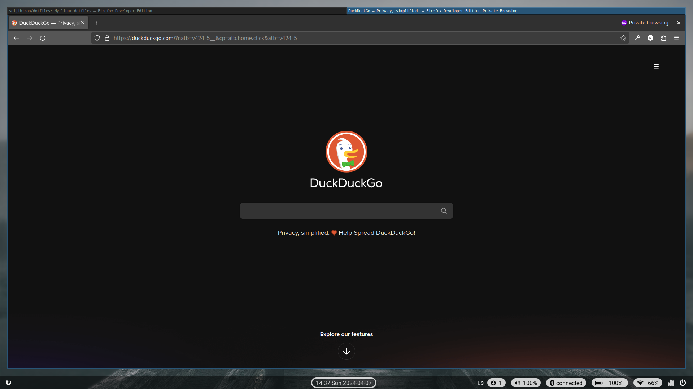
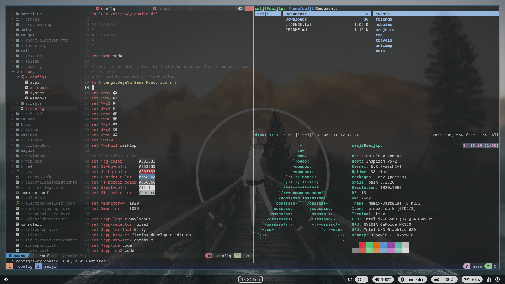
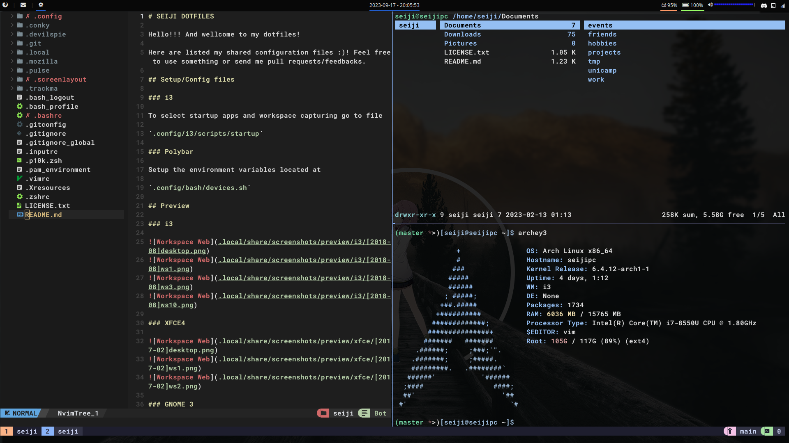

# SEIJI DOTFILES

Hello!!! And wellcome to my dotfiles!

Here are listed my shared configuration files 😃
Feel free to use something or send me pull requests/feedbacks.

## Preview

### Sway

Desktop | Workspace 1 | Workspace 0
:-:|:-:|:-:
 |  | 

### i3

Desktop | Workspace 1 | Workspace 0
:-:|:-:|:-:
 |  | 

### XFCE4

Desktop | Workspace 1 | Workspace 2
:-:|:-:|:-:
 |  | 

### GNOME 3

Desktop | Menu
:-:|:-:
 | 

## Apps used

List of apps used by default on each environment, listed `-` if there is no app is used, or if the default app from WM is used.

/ | Sway | i3 | XFCE4 | Gnome
:-:|:-:|:-:|:-:|:-:
Bar | waybar | polybar | - | -
Menus | fuzzel | rofi | - | -
Notifier | mako | xfce4-notifyd | - | -
Wallpaper | - | variety | variety | variety
Network Manager | nm-applet | nm-applet | - | -
Sysmenu | - | rofi | - | -
Layout Manager | - | -| devilspie | -
Terminal | kitten | xfce4-terminal | - | -
Filemanager | ranger | ranger | pcmanfm | thunar

## Setup/Config files

### i3

To select startup apps and workspace capturing go to file

`.config/i3/scripts/startup`

### Polybar

Setup the environment variables located at

`.config/bash/devices.sh`

## My Apps

My apps are located at `.config/.apps` but they might be too many,
I need to do a cleanup

Just run `$ sudo xargs pacman -S --needed --noconfirm < .config/.apps`

