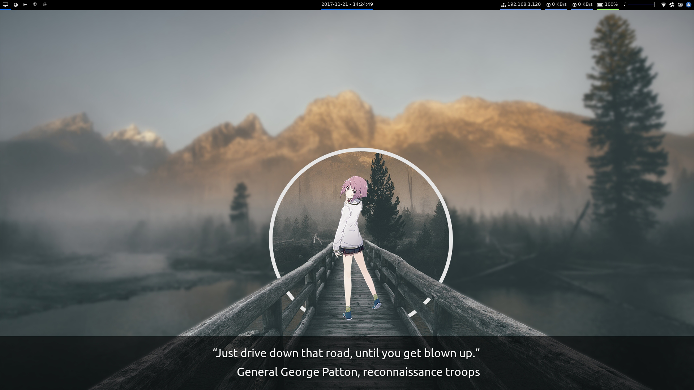
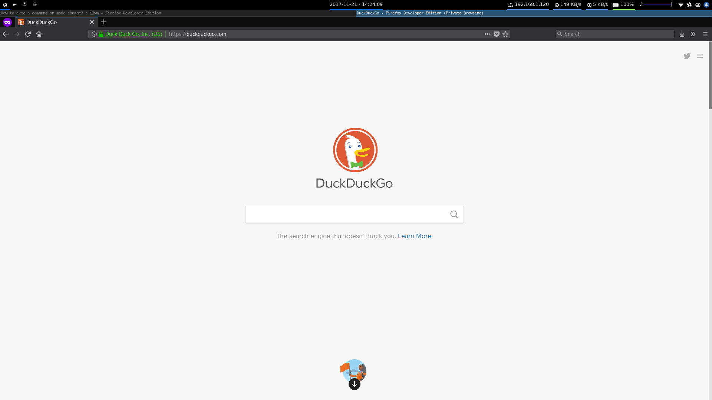
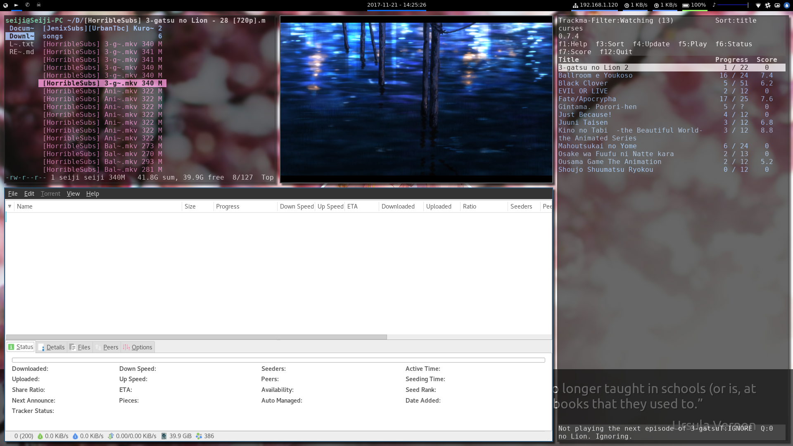
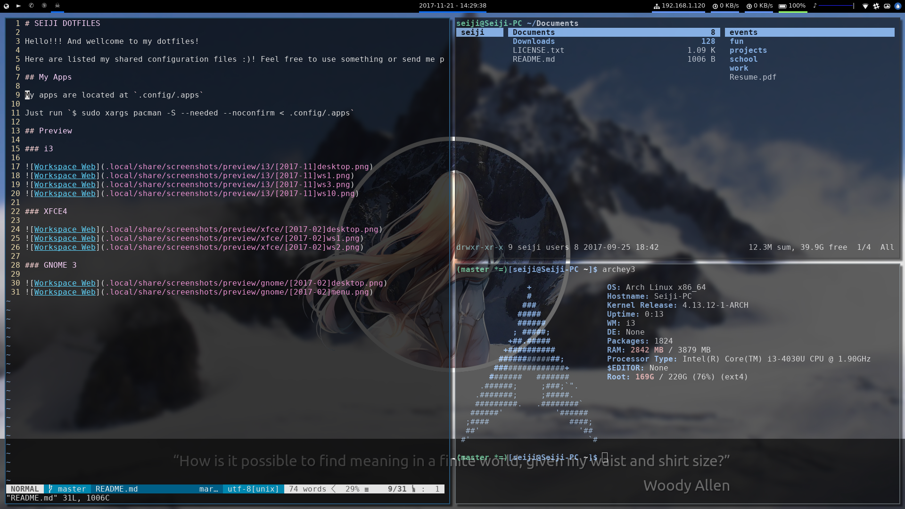

# SEIJI DOTFILES

Hello!!! And wellcome to my dotfiles!

Here are listed my shared configuration files :)! Feel free to use something or send me pull requests/feedbacks.

## My Apps

My apps are located at `.config/.apps`

Just run `$ sudo xargs pacman -S --needed --noconfirm < .config/.apps`

## Preview

### i3

### XFCE4

### GNOME 3

