# SEIJI DOTFILES


Hello! And welcome to my dotfiles!

Here are listed my shared configuration files 😃
Feel free to use something or send me pull requests/feedback.

## Install

This repo is meant to be cloned straight into `$HOME`. The `.gitignore` ignores
everything and whitelists only the files that should be tracked.

```sh
git clone --recurse-submodules git@github.com:seijihirao/dotfiles.git dotfiles
mv dotfiles/.git ~/.git && rm -rf dotfiles
cd ~ && git checkout .
```

Neovim lives in its own repo and is pulled in as a submodule at `.config/nvim`.

## Current setup (macOS)

Daily driver these days is a Mac, so the terminal stack is what gets the most love:

Tool | Config
:-:|:-:
Shell | zsh + [oh-my-zsh](https://ohmyz.sh) + [powerlevel10k](https://github.com/romkatv/powerlevel10k) — `.zshrc`, `.config/zsh/`, `.p10k.zsh`
Multiplexer | tmux + [tpm](https://github.com/tmux-plugins/tpm) + catppuccin — `.config/tmux/tmux.conf`
Editor | [neovim](https://github.com/seijihirao/nvim-config) (submodule) — `.config/nvim`
Git | `.gitconfig`, `.gitignore_global`

Shell config is split in small files under `.config/zsh/*.zsh` (aliases, history, env) and
sourced by `.zshrc`. The bash equivalents under `.config/bash/` are from the Linux days.

## Linux preview

### Sway

Desktop | Workspace 1 | Workspace 0
:-:|:-:|:-:
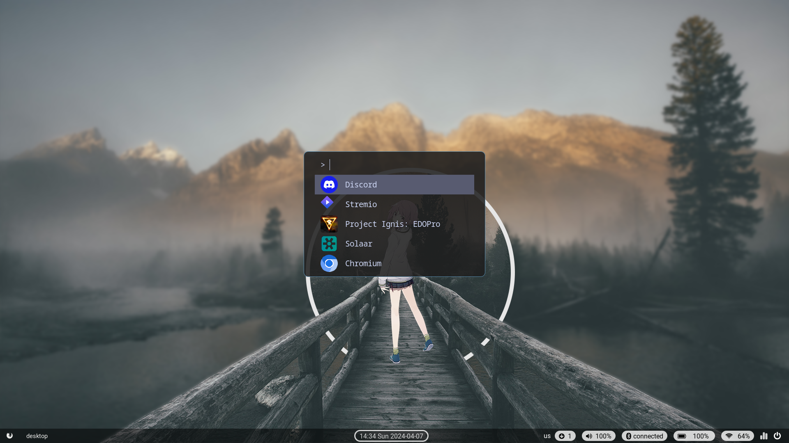 | 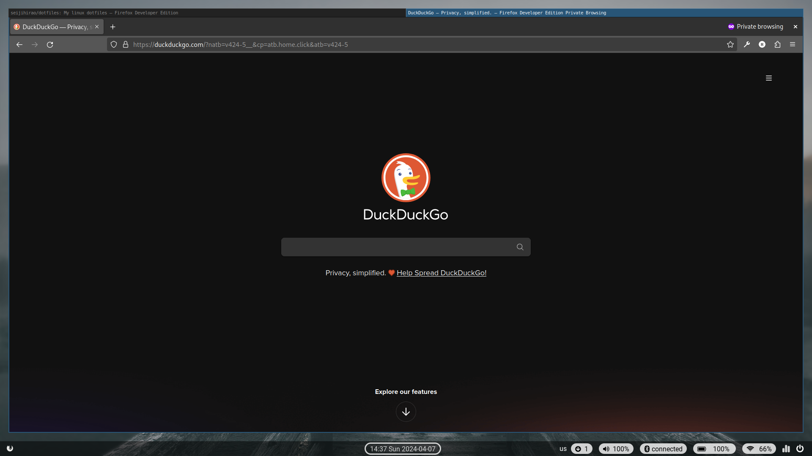 | 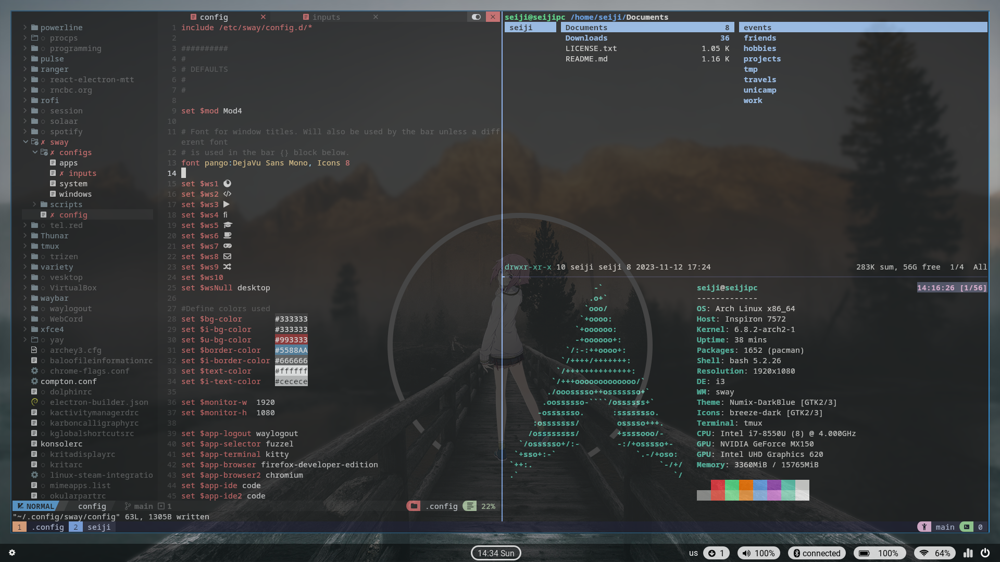

### i3

Desktop | Workspace 1 | Workspace 0
:-:|:-:|:-:
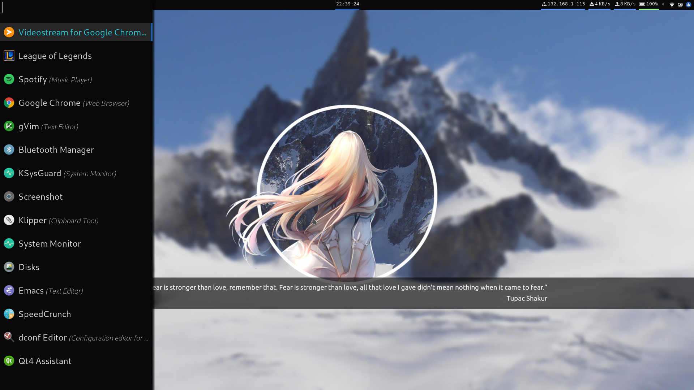 | 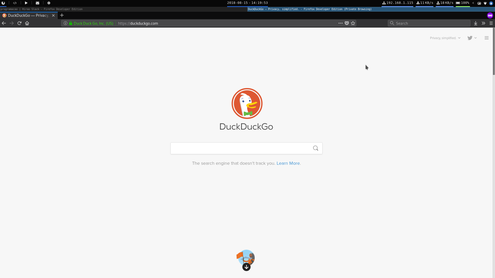 | 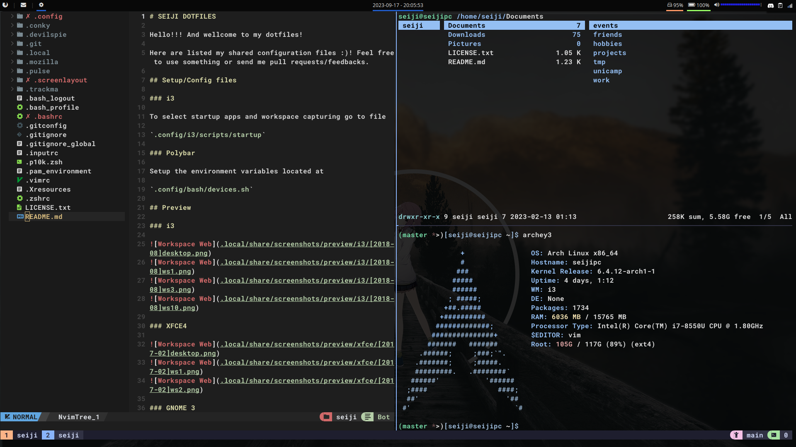

### XFCE4

Desktop | Workspace 1 | Workspace 2
:-:|:-:|:-:
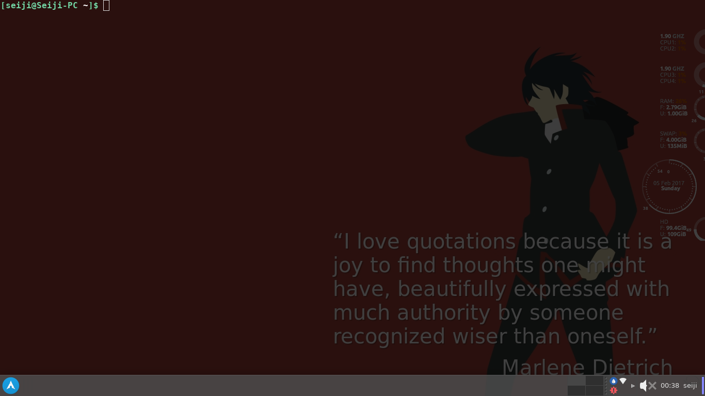 | 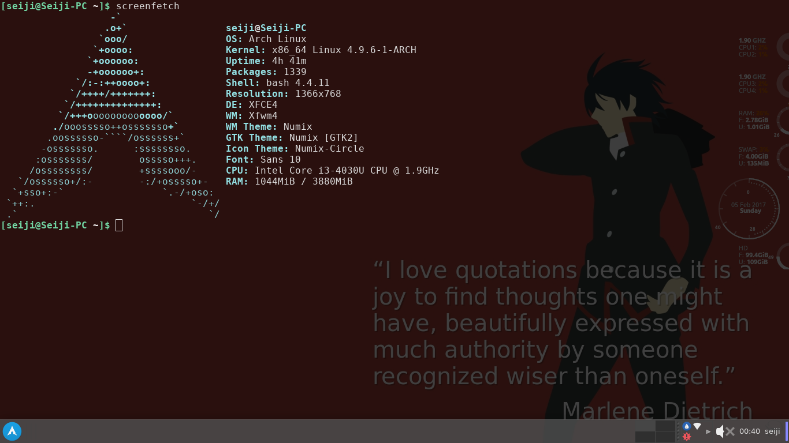 | 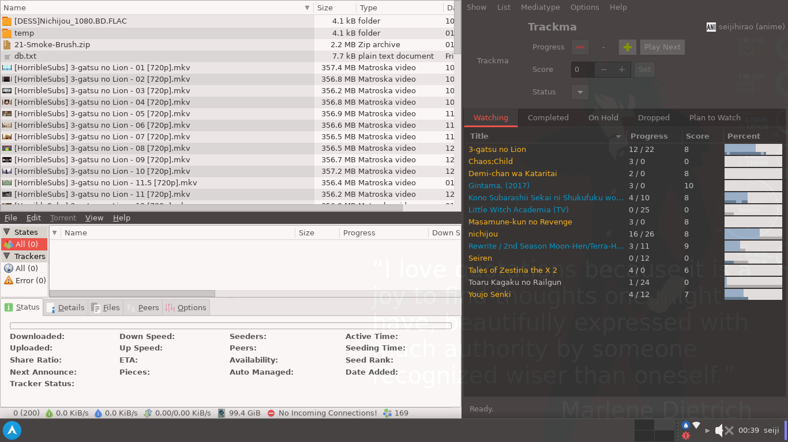

### GNOME 3

Desktop | Menu
:-:|:-:
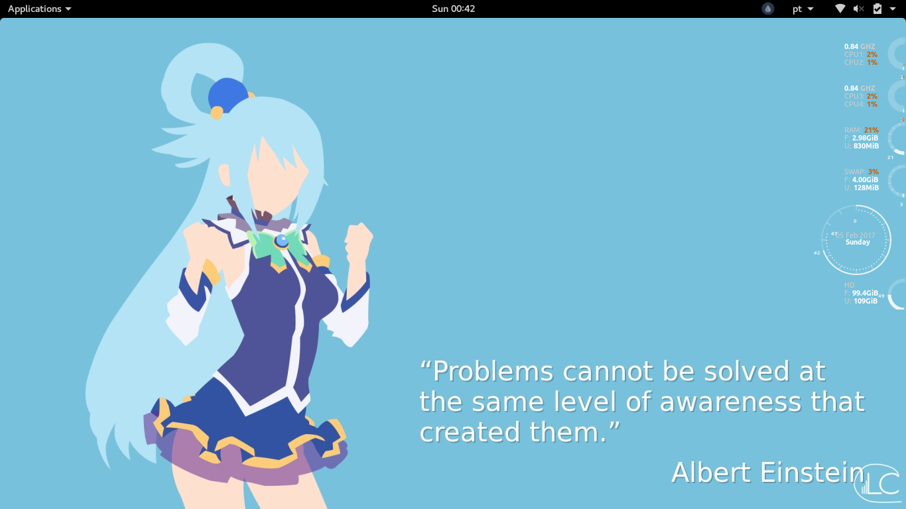 | 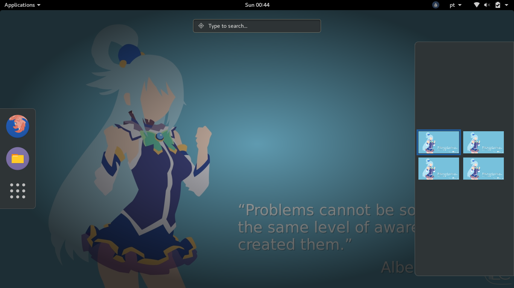

## Apps used (Linux)

Apps used by default on each environment. `-` means no app is used, or the WM default is used.

/ | Sway | i3 | XFCE4 | Gnome
:-:|:-:|:-:|:-:|:-:
Bar | waybar | polybar | - | -
Menus | fuzzel | rofi | - | -
Notifier | mako | xfce4-notifyd | - | -
Wallpaper | - | variety | variety | variety
Network Manager | nm-applet | nm-applet | - | -
Sysmenu | - | rofi | - | -
Layout Manager | - | - | devilspie | -
Terminal | kitty | xfce4-terminal | - | -
Filemanager | ranger | ranger | pcmanfm | thunar

The i3blocks config in `.config/i3/` is legacy from before polybar and is kept for reference.

## Setup/Config files (Linux)

### i3

To select startup apps and workspace capturing go to file

`.config/i3/scripts/startup`

### Polybar

Copy `.config/bash/devices.sh` to `.config/bash/devices`, uncomment and fill in
the battery and wifi device names. The copy is gitignored since it is machine-specific.

## Packages (Arch)

The package lists are at `.config/install/apps` and `.config/install/python-libs`.
They might be too many, I need to do a cleanup.

```sh
sudo pacman -S --needed --noconfirm - < .config/install/apps
```
